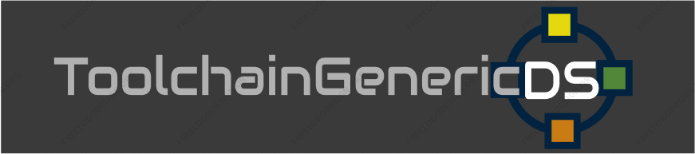

NTR/TWL SDK: TGDS1.65

TGDS FTP Server, supported on Winscp Client only. Other FTP Clients are unsupported and/or may not work.

Settings to connect to FTP Server:
user: anonymous
pass:
port: 21

Changelog:
Alpha 0.3:
- November 25th 2024: ToolchainGenericDS-FTPServer is fully reimplemented , supported on Winscp and fixed everything to get a stable session. Try it out! ;-)

Alpha 0.2:
- Add ToolchainGenericDS-multiboot (https://github.com/cotodevel/toolchaingenericds) loader code (ability to boot .NDS, homebrew files)

Alpha 0.1:
- Add FTP Server.

Latest stable release: http://github.com/cotodevel/ToolchainGenericDS-FTPServer/archive/TGDS1.65.zip

Bugs/Notes:
- DSWIFI is very unstable. That means there could be hangs between directory listing and/or receiving or sending files. Run TGDS-Ftpserver again.
- TWL Mode ToolchainGenericDS-FTPServer only supports legacy Access Points (WEP or unsecured). Issue: https://github.com/cotodevel/toolchaingenericds-ftpserver/issues/3

Coto